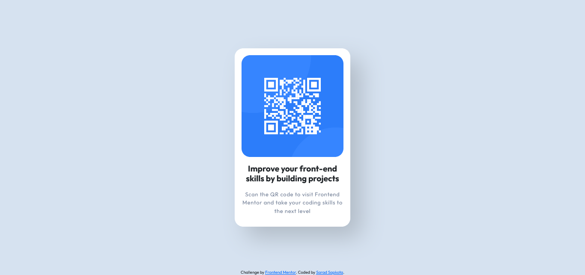

# Frontend Mentor - QR code component solution

This is a solution to the [QR code component challenge on Frontend Mentor](https://www.frontendmentor.io/challenges/qr-code-component-iux_sIO_H).

## Table of contents

- [Overview](#overview)
  - [Screenshot](#screenshot)
  - [Links](#links)
- [My process](#my-process)
  - [Built with](#built-with)
  - [What I learned](#what-i-learned)
  - [Continued development](#continued-development)
  - [Useful resources](#useful-resources)
- [Author](#author)

## Overview

### Screenshot



### Links

- Solution URL: [Solution](https://github.com/saradsa/qr-comp)
- Live Site URL: [Live Site URL](https://qrcode-ecru.vercel.app)

## My process

### Built with

- Semantic HTML5 markup
- CSS custom properties
- Flexbox
- CSS
- SASS
- Bootstrap

### What I learned

In this project, I learned how to do nesting in SASS.

```css
#main {
  display: flex;
  #content {
    height: 45vh;
    h1 {
      font-size: 1.2em;
    }
  }
}
```

Along with that I learned how to use semantic HTML
markups.

```html
<main>
  <section></section>
  <footer></footer>
</main>
```

Also I got to know about new design concepts like neumorphism.

### Continued development

After completion of this project, I'll try to focus more on mobile-first workflow and focus more on responsive designs.

### Useful resources

- [Bootstrap](https://getbootstrap.com/docs/5.1/getting-started/introduction/) - This helped me understand the use cases and overall documentation of Bootstrap.
- [w3schools](https://www.w3schools.com/) - This is an amazing website where you can clear any doubts related to HTML, CSS, Jacascript and other languages and technologies.

## Author

- Frontend Mentor - [@s4r4d](https://www.frontendmentor.io/profile/s4rad)
- Twitter - [@saradsa36](https://twitter.com/saradsa36)
